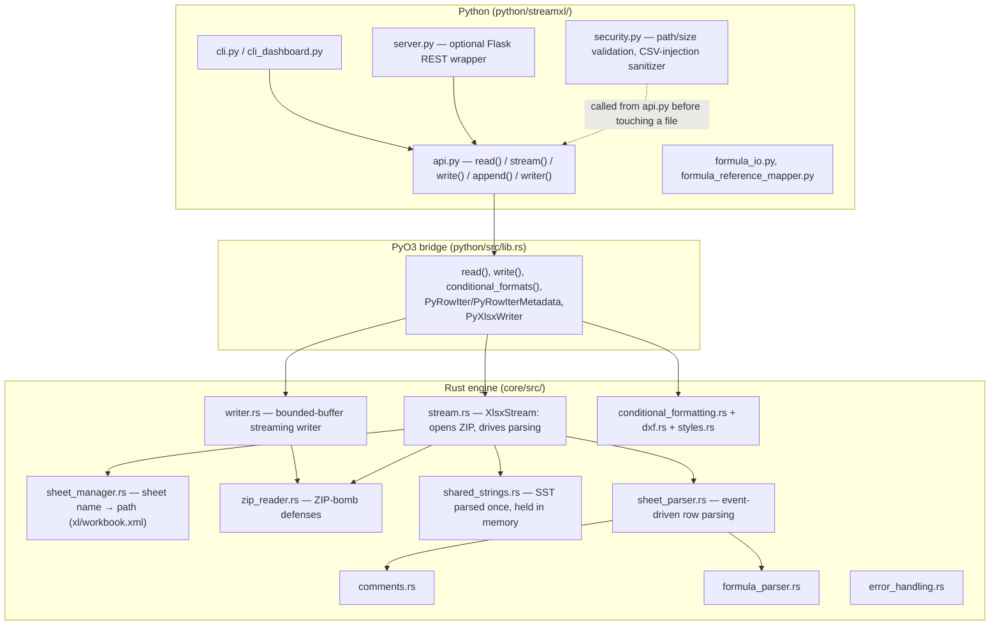

# Architecture

This describes the codebase as it actually is (checked against v5.3.0),
not an aspirational design. For the feature-level "what works, what
doesn't" list, see the [README's "Honest feature list"](../../README.md#honest-feature-list).

## Layers

## Data flow (read path)

1. `streamxl.read(path)` (Python) calls `security.validate_read_path()` —
   rejects non-`.xlsx`/`.xls` extensions, missing files, and files over
   512 MB, before any parsing happens.
2. The PyO3 bridge (`python/src/lib.rs`) opens an `XlsxStream`
   (`core/src/stream.rs`), which opens the ZIP via `zip_reader.rs`.
   `zip_reader.rs` enforces per-entry size, compression-ratio, and
   total-decompressed-size limits (512 MB / 30:1 / 1 GB) as entries are
   read — this is the ZIP-bomb defense, and it runs regardless of what
   the Python-level file-size check already did.
3. If a `sheet=` argument is given (or `sheets()`/`read_all()` is used),
   `sheet_manager.rs` resolves the sheet name against `xl/workbook.xml`
   to find the right `xl/worksheets/sheetN.xml` path. With no `sheet=`
   argument, `stream.rs` defaults to `xl/worksheets/sheet1.xml`.
4. `shared_strings.rs` parses `xl/sharedStrings.xml` into a `Vec<String>`
   once, up front — this is the one full-load in the read path, and it's
   normally small (a table of unique strings, not per-cell data).
5. `sheet_parser.rs` streams the target worksheet XML with `quick-xml`'s
   `read_event()` (not `read_event_into()` — see `.cursorrules` for why
   that distinction matters), yielding one row at a time. Cell values are
   resolved against the SST for `t="s"` cells, read inline for
   `t="inlineStr"`, and typed as bool/number/date/empty otherwise.
   `comments.rs` and `formula_parser.rs` are consulted when
   `with_formulas=True` is passed.
6. `python/src/lib.rs`'s `PyRowIter`/`PyRowIterMetadata` (built on
   `self_cell` to pair the owned `XlsxStream` with a borrowed `RowIter`
   across the FFI boundary) exposes this as a real Python
   `__iter__`/`__next__` iterator — one row crosses into Python per
   `next()` call, not the whole sheet at once.

## Data flow (write path)

`streamxl.write()` / `streamxl.writer()` / `streamxl.append()` go through
`core/src/writer.rs`'s `XlsxWriter`. As of v5.3.0 this buffers worksheet
XML and flushes it to the underlying ZIP stream every ~4 MB
(`FLUSH_THRESHOLD`) rather than only once at `finish()`, and enforces the
same per-sheet (512 MB) / total-workbook (1 GB) caps as the read side,
failing fast instead of growing unbounded. `append()` re-reads the
existing workbook's other sheets and re-writes the whole file — it is not
an in-place ZIP append.

## Known architectural debt

**`core/src/collaboration_detection.rs`, `core/src/incremental_recalculation.rs`,
and `core/src/cross_sheet_analysis.rs` (1,180 lines combined) are dead
code.** They are declared as `pub mod`/`pub use` in `core/src/lib.rs`,
have their own passing unit test suites, and were the headline features
of the v4.0.0 ("Real-time Collaboration Detection") and v5.0.0
("Cross-Sheet Dependency Analysis") releases per git history — but
**none of the three is referenced anywhere in `python/src/lib.rs`**, so
none of it is reachable from the actual Python package. The README's
"Honest feature list" correctly does not advertise these as features,
which means this code has been effectively abandoned in place rather
than exposed or removed. See `ROADMAP_HONEST.md` for the decision this
needs (finish wiring it up, or delete it).
